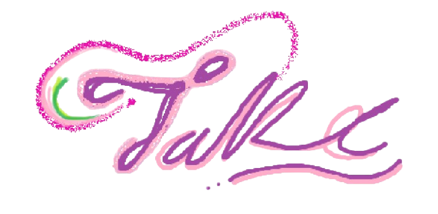
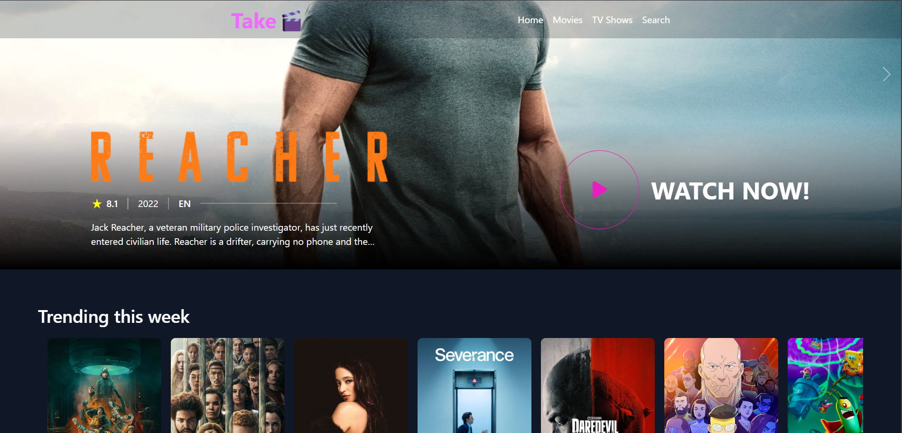
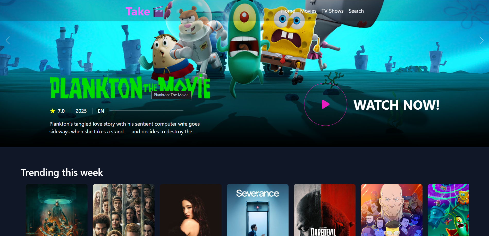

<p align="center">
  <div align="center">
    <a href="https://take-movie-website.vercel.app">
      
    </a>
  </div>
    <h3 align="center">Take🎬 - Stream movies without interruption/h3>
</p>
<p align="center">
    <a href="https://take-movie-website.vercel.app">Take</a> is an open-source movie streaming application. Watch and binge all latest and trending movies and TV-shows wihtout interupting and annoying ads, (expect at the player page which is not in our control). Enjoy a playful experience browsing and watching you favourite movies👻.
 </p>

<details>
<summary>View more Features</summary>

## Features

-Watch without annoying interruptions.
-Look up that movie or Tv-series you've been wanting to watch
-Design inspired by BroFlix.
-Features comming soon:
-Make a list and save your favourite movies and tv shows.
-Top Trending and latest movies provided by third party services nearest to
your subcontinent for smoothest experience.

</details>

## Preview Home

<div style="text-align: left;">
  
 
  
</div>


## Installation and Local Development

### 1. Make sure you have node installed on your device

### 2. Make a .env file for the tmdb api key

```bash
#Example .env
VITE_TMDB_API_KEY=YourAPIkey;

#Disclaimmer, fetch calls are not encrypted, so your api will be visible.
#Ecryption will be implemented soon.

```

### 3. Clone the repository and install dependencies

```bash
git clone https://github.com/sum1t7/Take-Movie-Website.git
#install dependencies
cd Take
npm install # or yarn

```

## Start the frontend servers

```bash
cd Take
npm run dev #start dev server at localhost:5174/

```

### Deploy your own instance of Take🎬

### Vercel

[](https://vercel.com/new/clone?repository-url=https://vercel.com/new/clone?repository-url=https://github.com/sum1t7/Take-Movie-Website.git)

### Render

[](https://render.com/deploy?repo=https://github.com/sum1t7/Take-Movie-Website.git)

### Contribution

- Pull requests are welcomed that address bug fixes, improvements, or new features.
- Fork the repository and create a new branch for your changes.

### Reporting Issues

If you discover any issues or have suggestions for improvement, please open an issue. Provide a clear and concise description of the problem, steps to reproduce it, and any relevant information about your environment.

### License

This project is licensed under the MIT License - see the [LICENSE](LICENSE) file for details.


### Support

Feel Free to drop a star 🌟 if you like my project.

© 2025 TAKE. All rights reserved

<p align="center" style="text-decoration: none;">Made by <a href="https://github.com/sum1t7" tarGET="_blank">Sumit 
</a>👍</p>
